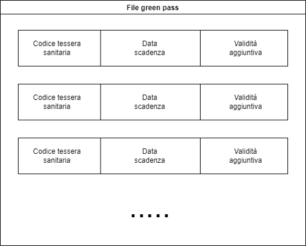

# Green Pass

- 1.0) [Introduction](#10-introduction)
- 2.0) [Description](#20-description)
- 3.0) [Protocol](#30-protocol)
    - 3.1) [Request](#31-request)
      - 3.1.1) [Request codes](#311-request-codes)
      - 3.1.2) [Request data structure](#312-request-data-structure)
    - 3.2) [Response codes](#32-response-codes)
- 4.0) [File strcture](#32-file-structure)

## 1.0) Introduction
This project implements a client/server architecture for managing Green Passes.

## 2.0) Description
The Green Pass management provides this operations:
- Creation
- Validity check
- Validation
- Invalidation

The creation of a Green Pass requires the user to insert his fiscal code, which will then be transmitted to an available vaccination center. 
The vaccination center will then create the Green Pass by sending a validity date associated to the fiscal code to ServerV. 
ServerV will store the indormations into a database.

For verifying the validity of a Green Pass, the user sends his fiscal code to a ServerG, which will request the period of
validity from ServerV.

Similar to the Green Pass verification phase, in both the validation/invalidation the client send the fiscal code to ServerG, which will request validation and invalidation from ServerV. 

The project implements a single client (for both the user and the vaccinal centre) capable of requesting the four operations necessary for Green Pass's management.

## 3.0) Protocol
Communication in both client-server and server-server, utilize a common protocol.
It is implemented as a TCP protocol.

### 3.1) Request
A basic request operation performs this operations:

In case of a request that needs additional data to be sent:

#### 3.1.1) Request codes

| Code | Name | Description
| ----------- | ----------- | ----------- |
| 0 | Verify | Verify a validity of a Green Pass |
| 1 | Invalidation | Invalidate a Green Pass |
| 2 | Validation | Validate a Green Pass |
| 3 | Create request | Requests a Green Pass creation |
| 4 | Creation | Creates a Green Pass |

#### 3.1.2) Request data structure

### 3.2) Response codes

| Code | Name | Description
| ----------- | ----------- | ----------- |
| -3 | Server error | The server malfunctioned during the request|
| -2 | Invalid data | The data sent is not valid |
| -1 | Not implemented | The operation is not implemented |
| 0 | Not valid | Green Pass is not valid |
| 1 | Valid | Green Pass is valid |
| 2 | Additional data | The request needs additional data |

## 4.0) File structure
Green Passes are memorized in a file, using a table structure with fixed sizes.

